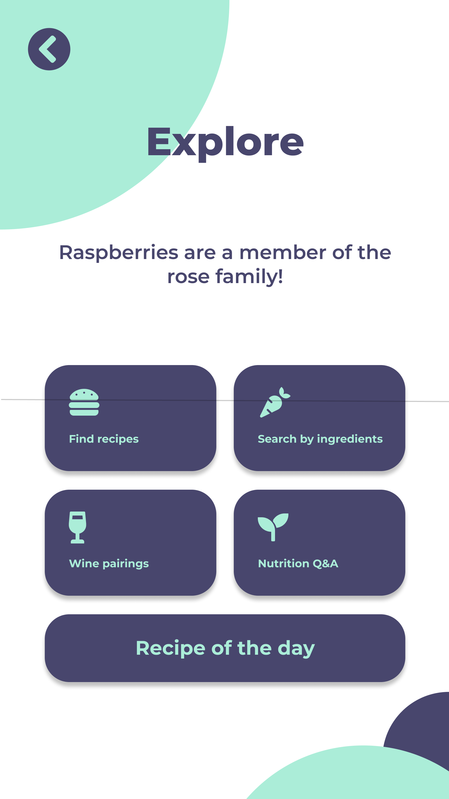
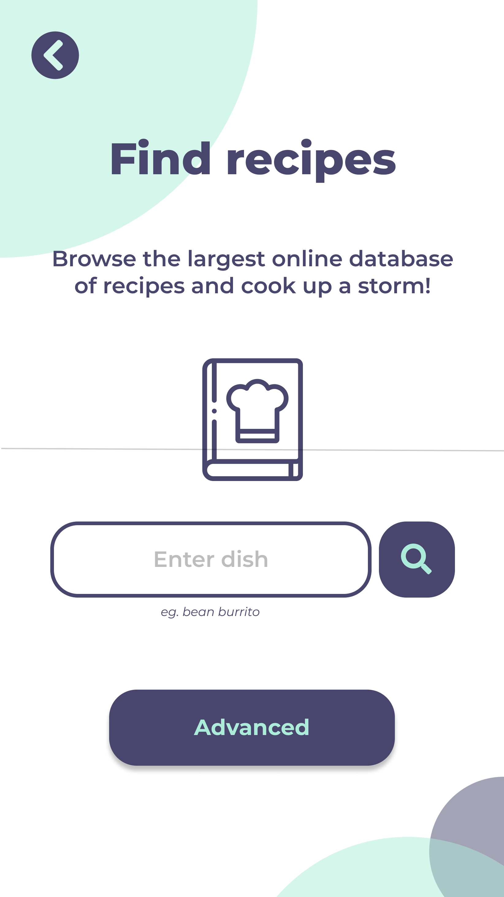
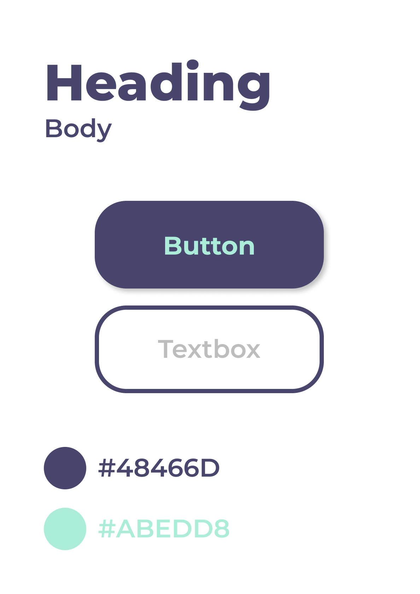

# The Lazy Chef (Android)

**_Find quick recipes based on the items in your kitchen!_**

## Features

- Find recipes with filters for diets, intolerances, etc.
- Search by ingredients in your kitchen
- Find dish pairings for wine types
- Get nutrition based queries answered

## Screenshots

  
  
  

## UI Kit

  

## Resources

- This project uses the [Spoonacular Food API](https://spoonacular.com/food-api)
- Designed with [Figma](https://figma.com)
- Loading animations from [AndroidViewAnimations](https://github.com/daimajia/AndroidViewAnimations)
- Color palette from [Color Hunt](https://colorhunt.co)
- Illustrations from [unDraw](https://undraw.co)
- Icons from [Font Awesome](https://fontawesome.com) and [flaticon](https://www.flaticon.com)

## Web App

Check out the web version here! : https://gauthammk.github.io/the-lazy-chef/
